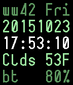

# DataFace
A Nerdy Pebble Time Watch Face

Screen Shot
---

Features:
---
  - Terse, easy-to-read layout:
    - ISO Work Week Number, Abbreviated Day of Week
    - Date (YYYYMMDD)
    - 12 or 24 hour time (HH:MM:SS, respects watch settings)
    - Weather (Current Conditions abbreviated, Temperature)
    - Bluetooth Status (bt = connected, nc = not connected), Battery Status
  - Fetches the weather with your [OpenWeatherMap AppID](http://openweathermap.org/appid).
    Remember to sign up and put your AppID into the settings for the watch face.
  - Can display temperature in different units: Fahrenheit, Celcius, and Kelvin.
  - Doesn't drain your battery.

Planned Features:
---
  - Support for Other Weather APIs (Yahoo, wunderground, etc)
  - More pages/windows with moar data like pollution/haze, barametric pressure,
    latitude, longitude, altitude, etc.
  - Customizable Colors
  - Notification / Timeline indicator
  - AM/PM Indicator
  - Time Zone Indicator
  - CI through [Travis CI](https://travis-ci.org/), [travis-ci-pebble](https://github.com/spangborn/travis-ci-pebble)

Build Instructions
---
You'll need the [pebble-sdk](http://developer.getpebble.com/sdk/) installed.

For a one-stop-shop - clean, build, install, and tail the device logs,
run the following:

  1. Point the `pebble` tool to your phone's hostname or IP address.
    - For bash, zsh, etc run:
      `export PEBBLE_PHONE=<hostname or address>`
    - For csh, tcsh, etc run:
      `setenv PEBBLE_PHONE <hostname or address>`
  1. Run `make` or `gmake`.

Read the [Makefile](Makefile) for more info.

Contributing
---
I happily accept feature and pull requests.  I'll probably have comments and
suggest alterations to suit my style and chosen semantics.  It's not you, it's
code.  I don't get paid to work on this, so requests will be resolved as I have
the enthusiasm and time to do so.

